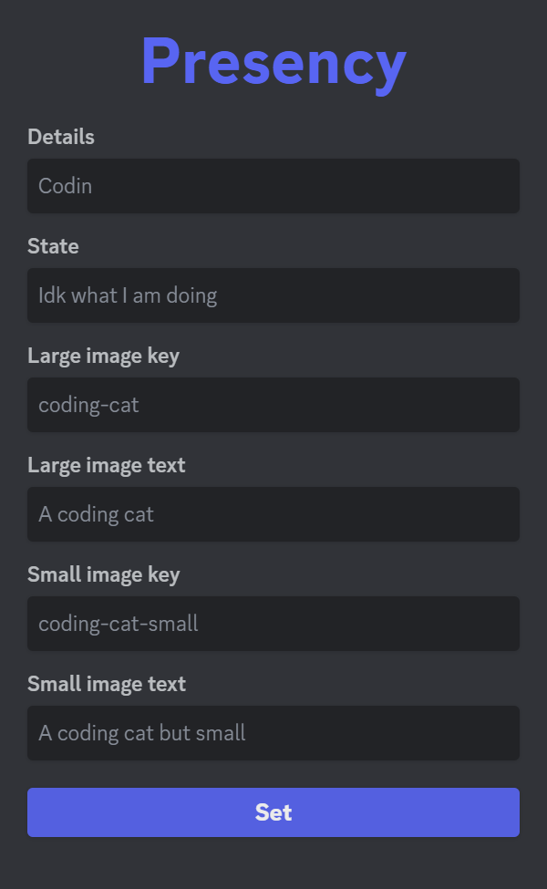

# Presency - Customize your Discord Rich Presence easily

Presency is the easiest way to customize Discord Rich Presence to whatever you feel like with just a few clicks! It is built with Go and Vite using the Wails framework.



> [!NOTE]
> This porject was made for fun and as an oportunity to learn the awesome Wails framework

## Features

Presency has the basic features you would expect from an app like this, this includes:

- Custom Details
- Custom State
- Custom Big Image
- Custom Small Image

## Limitations

As of now Presency has the following limitations:

- You need to provide your Client ID on every start up of the app _so keep it somewhere safe_
- Presency doesn't support changing the start/end time of the activity
- You can't use the button feature
- When you click the `Developer Portal` on the modal it will open the webpage on the app due to how Wails works _don't worry it won't hack you_
- You cannot re-open the modal without restarting the app

## Getting Started

To get started you firstly need to create an app in the Discord Developer Portal [here](https://discord.com/developers/applications), to create an app follow these steps:

1. Click create application
2. Give it a name _this name will appear on Discord as the "game", so Discord will say playing yourapp_
3. Click the Rich Presence button and then the Art Assets sub-button
4. Add your art assets, ideally as 512x512 PNGs, give them a name you remeber _because you will use this in presency_ and click save _it may take up to 15 minutes for them to appear on the dashboard so be patient_
5. Go to the OAuth2 menu and copy your Client ID
6. (optional) Go to General Infortmation and give your app a description and maybe a logo
7. (optional) Go back to Rich Presence and set a logo there too

After you create your app download the latest executable from the [Releases](https://github.com/steveiliop56/presency/releases) page and...have fun!

## Building

To build the app you need Go 1.20+, NPM/Node and the Wails CLI, you will also need some additional dependencies which are described [here](https://wails.io/docs/gettingstarted/installation) along with the installation of the Wails CLI. Finally run the following commands:

Clone the repository:

```bash
git clone https://github.com/steveiliop56/presency
```

Change directory to the repository:

```bash
cd presency
```

Build:

```bash
wails build --clean
```

Wails will automatically detect your OS and build an executable, if you want to cross compile for other platforms, use this command:

```bash
wails build --clean --platform windows/amd64
```

This command will build for Windows amd64.

## License

The project is licensed under the GPL V3 License. You may modify, distribute and copy the code as long as you keep the changes in the source files. Any modifications you make using a compiler must be also licensed under the GPL license and include build and install instructions.

## Contributing

I don't know why you would want to contribute to this project _lol_, but if you want to fix my terrible code you are welcomed to do so. To run the app in development mode you can follow the same steps for building but use the `wails dev` command instead.

## Credits

Thanks a lot to:

- [Bakuh Huda](https://www.freepik.com/author/user23531035/icons) for the app icon
